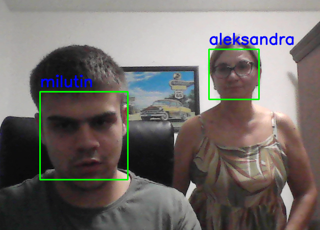
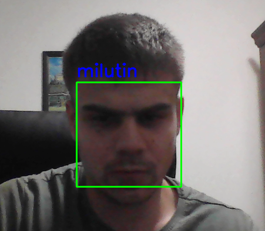

# Face Recognition Using the KNN Algorithm

This project implements a real-time face recognition system using a camera, the OpenCV library, the `face_recognition` library, and the K-Nearest Neighbors (KNN) algorithm. The system was developed as an academic project in the field of artificial intelligence.

## 🔧 Technologies

- Python 3.x
- OpenCV
- face_recognition
- NumPy

## 📁 Project Structure

```
projekat-knn/
├── main.py                  # Recording and encoding user faces
├── rec.py                   # Real-time face recognition
├── haarcascade_frontalface_default.xml  # Face detection model
├── data/                    # Folder with encoded .npy files
├── README.md                # Project description
├── requirements.txt         # List of required Python libraries
```

## 📸 Features

- Recording and encoding user faces
- Saving feature vectors to a `.npy` file
- Loading the database of known faces
- Face recognition using a manually implemented KNN algorithm
- Displaying the person's name above the detected face

## ▶️ Running the Project

1. Install the required libraries:
```
pip install -r requirements.txt
```

2. First run `loadData.py` to capture and save face samples.
3. Then run `recSystem.py` for face recognition.

## 📂 Dataset

- `.npy` files are automatically created for each user and saved in the `./data/` folder.
- Each file contains 20 encoded face samples.

## ⚠️ Note

- The `haarcascade_frontalface_default.xml` file must be in the same folder as the scripts.
- The application uses the default webcam (`device 0`).

## 🖼️ Face Recognition Examples

Below are images illustrating the application running in real time:




These images show an example where the application detects a user's face via the camera and successfully identifies the person based on previously recorded samples using the KNN algorithm.

## 📄 Author

Milutin Jovanović  
Faculty of Electronic Engineering, University of Niš  
2024/2025 – Artificial Intelligence
